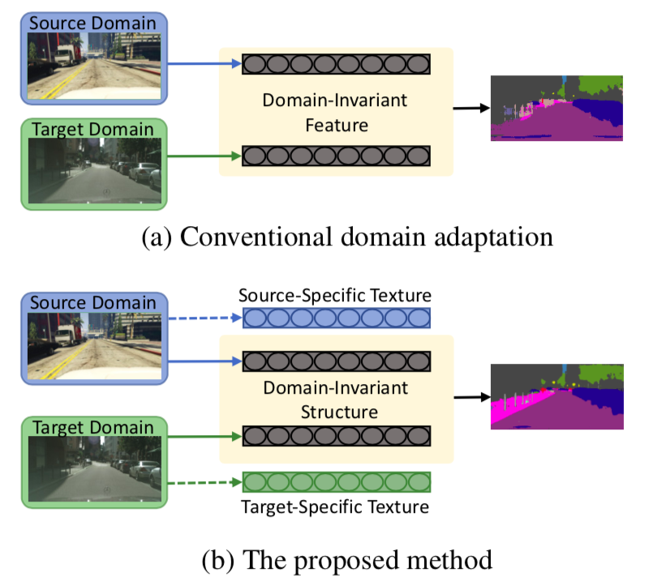

I am an engineer in Qualcomm Technologies Inc., working on 3D reconstruction. Supervised by Prof.<a href="https://walonchiu.github.io"> Wei-Chen Chiu</a> and Prof. <a href="http://vlab.ee.nctu.edu.tw/advisor/">Sheng-Jyh Wang</a>, I received my M.S. from <a href="https://www.nctu.edu.tw/en">Nation Chiao Tung University </a> in 2019. My research interest is machine learning for computer vision. One of my research results has been published on CVPR2019.

## Research Interest
---
I am interested in the area ofcomputer visionandmachine learningincluding but not limited to
* Metric learning
* Generative models
* 2D scene understanding
* 3D scene understanding & reconstruction

## Education

---
 M.S.,<a href="https://eenctu.nctu.edu.tw/">Institute of Electronics</a>, <a href="http://www.nctu.edu.tw/">National Chiao Tung University</a>

 B.S.,<a href="http://www.ieo.nctu.edu.tw/">Department of Photonics</a>, <a href="http://www.nctu.edu.tw/">National Chiao Tung University</a>

 <a href="http://www.hchs.hc.edu.tw/">National Hsinchu Senior High School</a>

## Experiences

---
* Engineer, <a href="https://www.qualcomm.com/">Qualcomm Technologies Inc.</a>, Hsinchu, Summer 2020
* Private (Compulsory), R.O.C. Army, Taipei, Spring 2020
* Engineer, <a href="https://www.qualcomm.com/">Qualcomm Technologies Inc.</a>, Hsinchu, Winter 2019
* Teaching Assistant, Computer Vision, NCTU, Spring 2019
* Internship,<a href="https://ictjournal.itri.org.tw/">Industrial Technology Research Institute</a> - Hsinchu, Taiwan, Jul. 2017 - Aug. 2017
* Internship, <a href="https://www.youngoptics.com/en">YoungOptics Inc</a> - Hsinchu, Taiwan, Jul. 2016 - Aug. 2016
* Teaching Assistant, <a href="http://www.alab.ee.nctu.edu.tw/wpmu/elab/">Electronics Laboratories</a>, NCTU, Fall 2015, Fall 2016

## Publications

---
* <u>Wei-Lun Chang</u>&#x2A;, Hui-Po Wang&#x2A;, Wen-Hsiao Peng, Wen-Chen Chiu. [All about Structure:Adapting Structural Information across Domains for Boosting Semantic Segmentation](https://arxiv.org/abs/1903.12212). In International Conference on Computer Vision and Pattern Recognition (CVPR), 2019. [[Code]](https://github.com/a514514772/DISE-Domain-Invariant-Structure-Extraction) [[Project Page]](https://a514514772.github.io/DISE-Domain-Invariant-Structure-Extraction/)
* <u>Wei-Lun Chang</u>&#x2A;, Hui-Po Wang&#x2A;, Wen-Hsiao Peng, Wen-Chen Chiu. Disentangling domain-invariant structural information for im-proving semantic segmentation. In The Conference on Computer Vi-sion, Graphics, and Image Processing (CVGIP), 2019.

Page template forked from <a href="https://github.com/evanca/quick-portfolio">evanca</a>

<!-- Remove above link if you don't want to attibute -->
